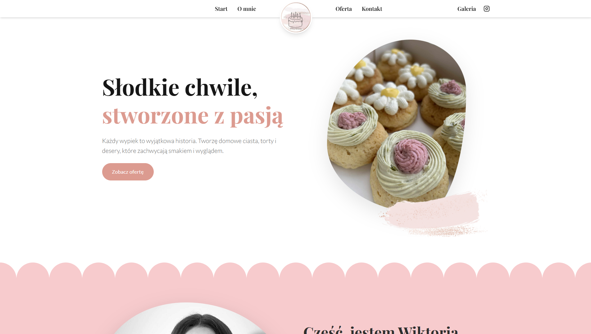
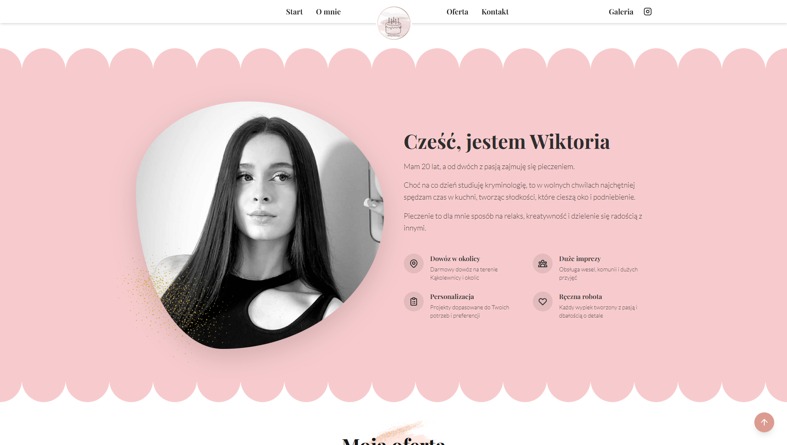
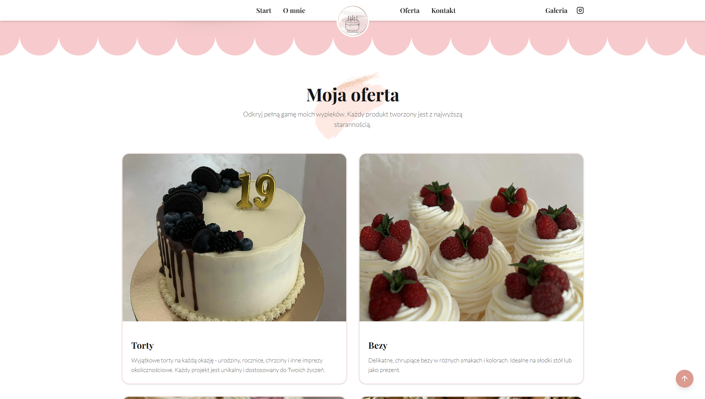
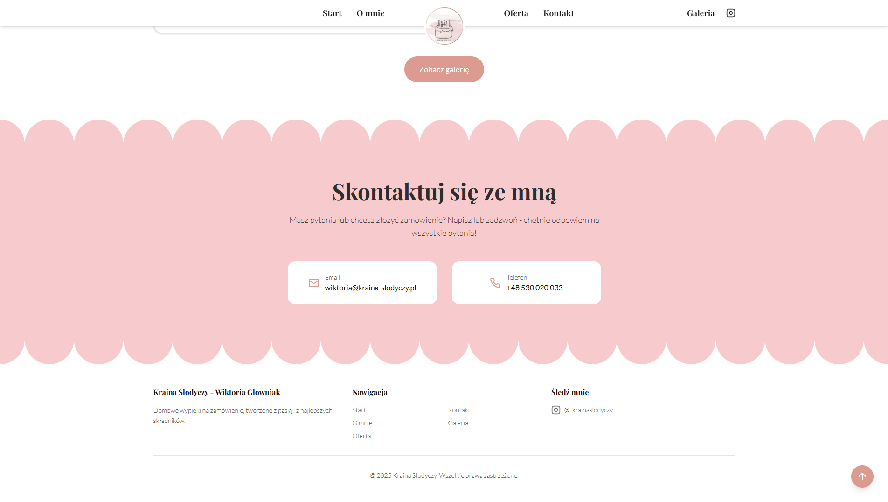
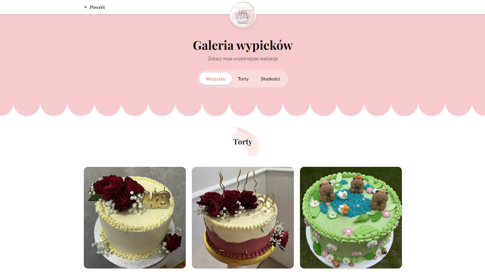
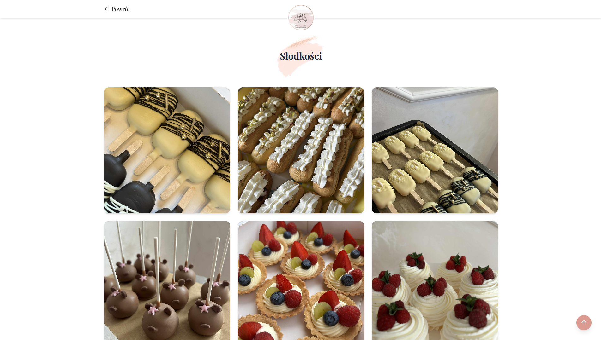
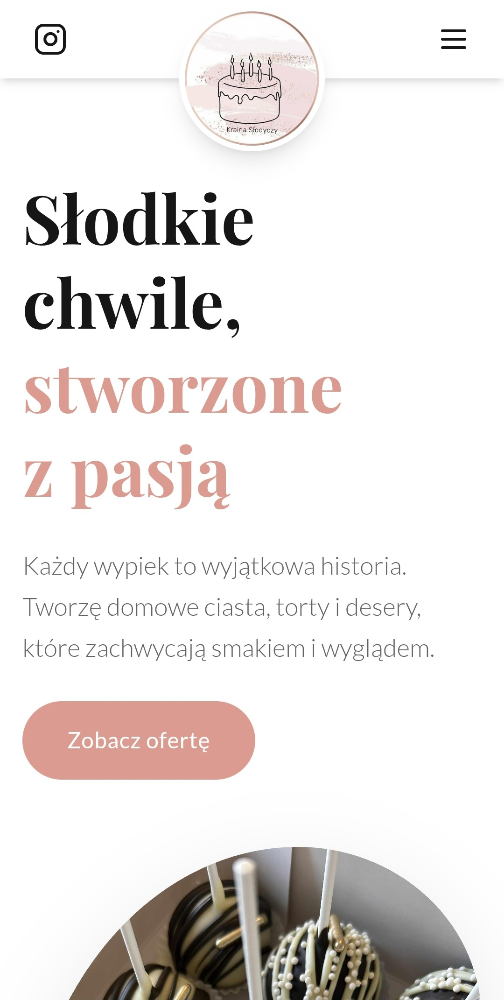
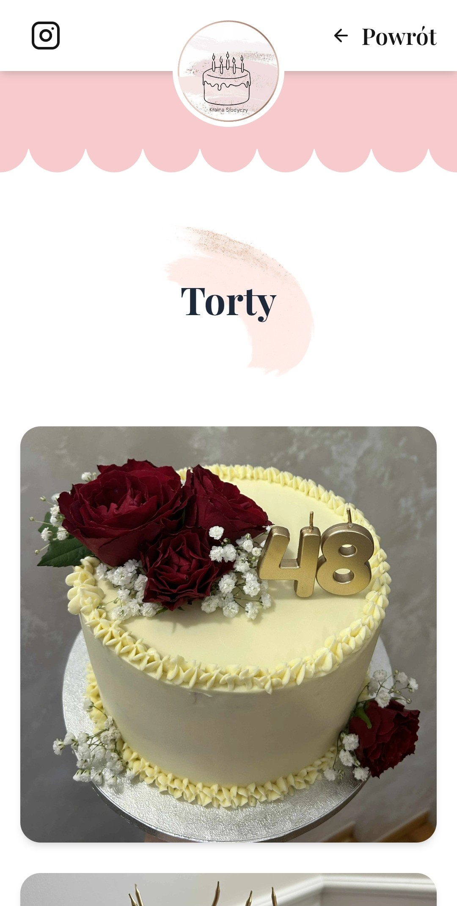

# Kraina Słodyczy - Website for a person who bakes cakes and other sweets to order

<div align="center">
  
</div>

## Table of Contents
- 🚀 [Project Overview](#project-overview)
- ✨ [Features](#features)
- 💻 [Technologies](#technologies)
- 📋 [Requirements](#requirements)
- 🛠️ [Setup Instructions](#setup-instructions)
- 📸 [Screenshots](#screenshots)

## Project Overview
The "Kraina Słodyczy" website is a place whose main purpose is to showcase the owner's previous baked goods in order to encourage new customers to use her services. It simply and clearly presents the current offer and contact details.It simply and clearly presents the current offer and contact details.
> [!NOTE]  
> Website is only available in Polish language version!

## Features

- 🎂 Simple gallery of baked goods with a photo filtering option 
- ✨ Elegant, modern design
- 📱 Full responsiveness

## Technologies

**Frontend**
- Next.js
- React
- Tailwind CSS
- Lucide

## Requirements
Software versions used for development:
- Next.js 15.2.4
- React 19.1.0
> [!WARNING]  
> Compatibility with earlier versions has not been tested.

## Setup Instructions

Just go to www.kraina-slodyczy.pl.

OR

To run a project locally, you must have Node.js and npm installed. 
> [!IMPORTANT]  
> *Download guide: [Installing Node.js and npm](https://docs.npmjs.com/downloading-and-installing-node-js-and-npm)*

1. Download and extract the "Kraina Słodyczy" folder.
2. Navigate to the folder in your terminal.
3. Install dependencies and launch the app:
```
$ npm install
$ npm run dev
```
4. Access the application at [http://localhost:3000](http://localhost:3000).

## Screenshots







### Mobile Device
 
 
